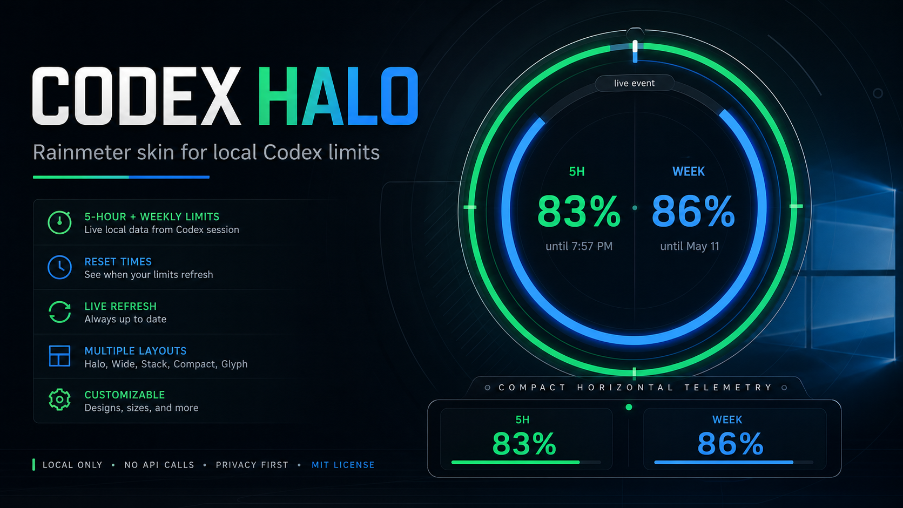
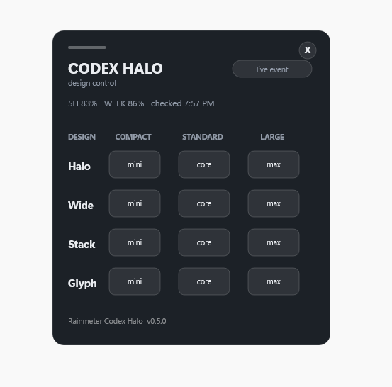
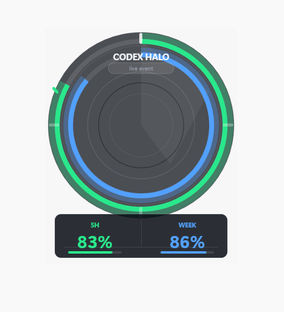
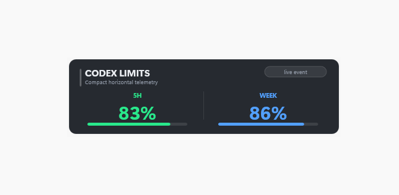
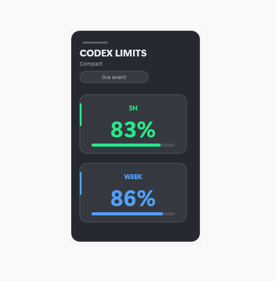
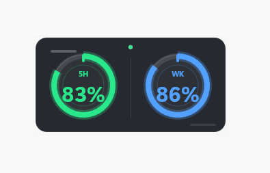
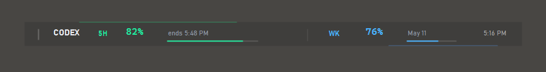
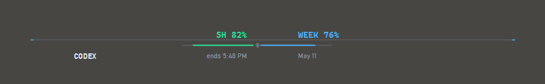
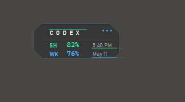

# Codex Halo

<p align="center">
  
</p>

<p align="center">
  <strong>A Rainmeter skin for Codex usage status.</strong><br>
  See your 5-hour and weekly Codex limits at a glance, right on the Windows desktop.
</p>

<p align="center">
  <a href="#install">Install</a> |
  <a href="#designs">Designs</a> |
  <a href="#privacy">Privacy</a> |
  <a href="CHANGELOG.md">Changelog</a>
</p>

## Preview

<p align="center">
  
</p>

<table>
  <tr>
    <td align="center"><br><strong>Halo</strong></td>
    <td align="center"><br><strong>Horizontal</strong></td>
  </tr>
  <tr>
    <td align="center"><br><strong>Vertical</strong></td>
    <td align="center"><br><strong>Glyph</strong></td>
  </tr>
  <tr>
    <td align="center"><br><strong>Streamline</strong></td>
    <td align="center"><br><strong>Signal Rail</strong></td>
  </tr>
  <tr>
    <td align="center" colspan="2"><br><strong>Micro Stack</strong></td>
  </tr>
</table>

## Features

- Shows Codex 5-hour and weekly limit remaining
- Includes reset time/date and last local refresh time
- Seven display styles, including refined Signal Rail and Micro Stack concepts
- Control panel for switching layouts
- Manual refresh from the skin or Rainmeter right-click menu
- Respects Rainmeter's native Position menu for layer behavior
- Reads Codex's own usage source for app-matched values, with a local cache fallback

## Requirements

- Windows
- Rainmeter
- Codex installed and signed in
- Node.js on `PATH` for app-matched live usage
- PowerShell, included with Windows

## Install

Copy this folder to:

```text
%USERPROFILE%\Documents\Rainmeter\Skins\Rainmeter Codex Halo
```

In Rainmeter, refresh skins and load:

```text
Rainmeter Codex Halo\Welcome\Welcome.ini
```

Click **Start Halo** to refresh the local Codex snapshot and open the main skin.

## Designs

Use the control panel to switch designs and sizes:

```text
Rainmeter Codex Halo\Control\Settings.ini
```

Available designs:

- `Halo` - circular ring display
- `Horizontal` - wide compact bar
- `Vertical` - stacked compact panel
- `Glyph` - minimal twin-meter display
- `Streamline` - thin horizontal strip with visible 5-hour end time and weekly reset date
- `SignalRail` - ultra-thin segmented rail with refined data typography
- `MicroStack` - compact two-line stack with polished micro readouts

## Refresh

Click the skin's status pill, or use the Rainmeter right-click menu:

```text
Refresh Codex Data
```

The current values are stored locally in:

```text
@Resources\CodexLimits.inc
```

The guarded 30-second refresh updates displayed values without reloading the active skin, so Rainmeter's own position and layer settings stay under user control.

## Privacy

Codex Halo uses the local sign-in token already stored by Codex and asks Codex's own usage endpoint for the same values shown in the app account menu. It does not use a third-party endpoint or custom server.

If live usage cannot be read, Codex Halo keeps the last cached values or falls back to legacy local `rate_limits` session events.

## Version

Current build: `0.5.12`

See [CHANGELOG.md](CHANGELOG.md) for release notes.

Released under the MIT License.

